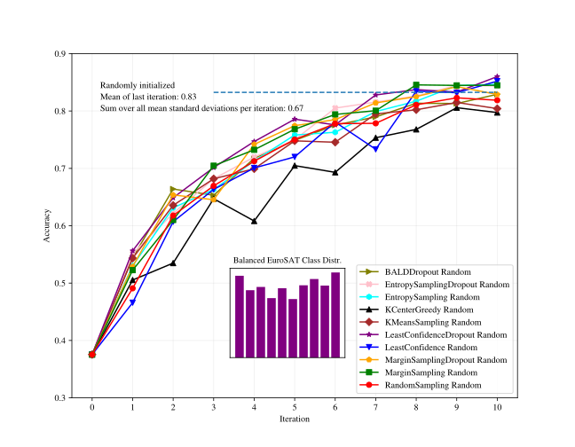
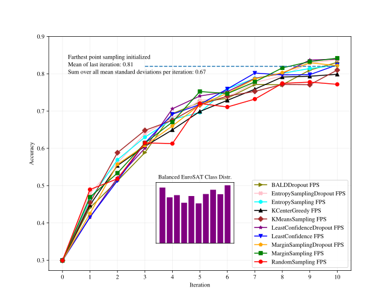
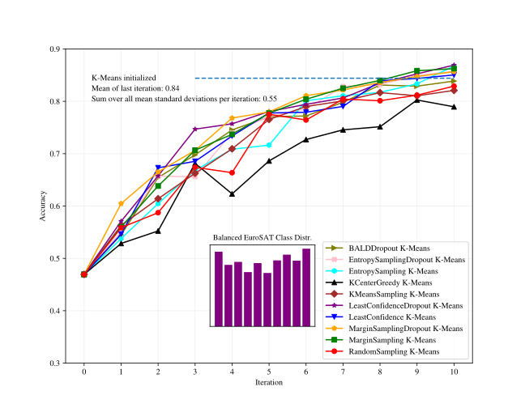
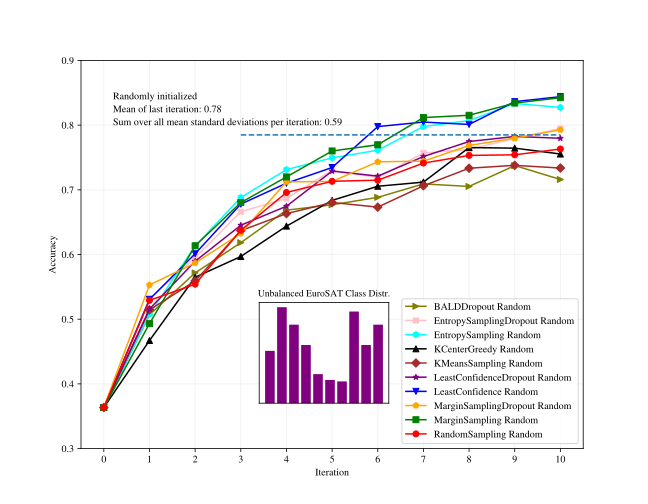
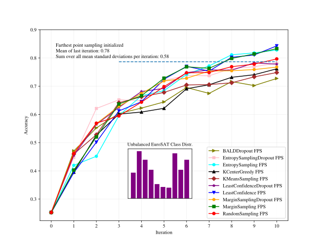
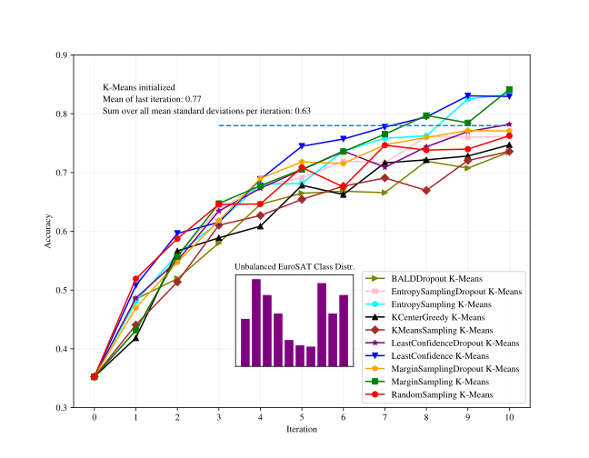
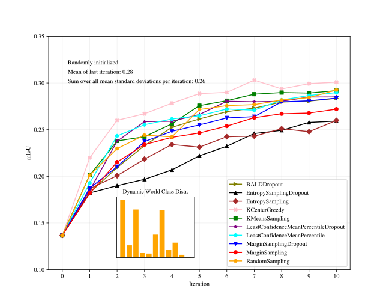
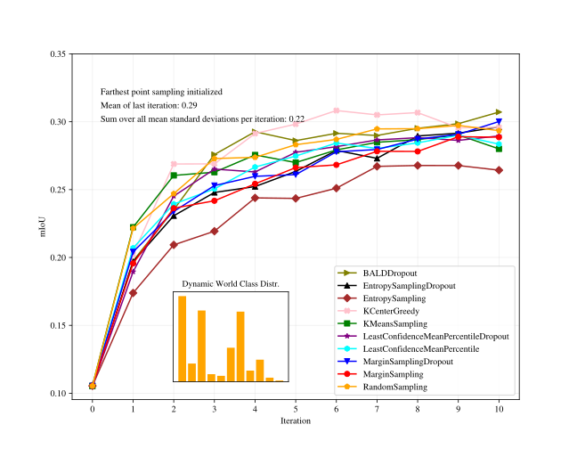
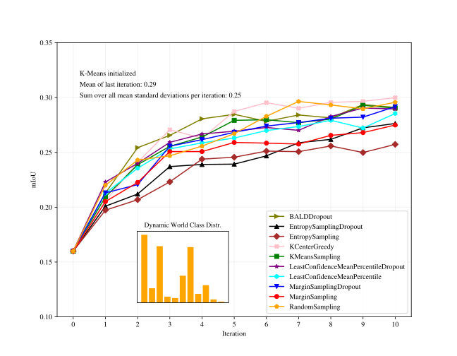

# Active Learning for Sentinel-2 Satellite Imagery

This repository provides an active learning framework for classification and segmentation tasks on Sentinel-2 satellite imagery. It includes configurable modules for training and evaluating machine learning models with active learning strategies on the EuroSAT and Dynamic World datasets.

> **Acknowledgment**: This project heavily utilizes code and active learning strategies from [deep-active-learning](https://github.com/ej0cl6/deep-active-learning) by Natural Language Processing @UCLA, which is licensed under the MIT License. Our team has significantly adapted this framework to support specific requirements for EuroSAT and Dynamic World, and we have also introduced custom initialization strategies, SLURM job handling, and integration with Hydra for configuration management.


## Key Customizations

This repository builds on the **deep-active-learning** framework, with several adjustments:

1. **Dataset-Specific Adaptations**: Adjustments were made to align the framework with EuroSAT and Dynamic World datasets, tailoring data loading and processing routines to meet these datasets' requirements.
2. **New Initialization Strategy**: Additional initialization strategy have been introduced
3. **SLURM and Hydra Integration**: This repository integrates SLURM job scheduling with Hydra for seamless configuration management across various experimental runs and computing environments.

## Getting Started

### Prerequisites

Ensure you have Python and dependencies installed. Use the provided `requirements.txt` to install necessary packages, such as `torch`, `numpy`, `sklearn`, and `hydra`.

```bash
pip install -r requirements.txt
```

# Results

The following plots illustrate the comparison of different active learning strategies on Sentinel-2 satellite imagery.

<div style="display: flex; flex-wrap: wrap; gap: 10px;">

  <div style="flex: 1; min-width: 30%; max-width: 30%; text-align: center;">
    
    <p>Balanced EuroSAT Randomy Initialized</p>
  </div>

  <div style="flex: 1; min-width: 30%; max-width: 30%; text-align: center;">
    
    <p>Balanced EuroSAT FPS Initialized</p>
  </div>

  <div style="flex: 1; min-width: 30%; max-width: 30%; text-align: center;">
    
    <p>Balanced EuroSAT K-Means Initialized</p>
  </div>

  <div style="flex: 1; min-width: 30%; max-width: 30%; text-align: center;">
    
    <p>Balanced EuroSAT Randomy Initialized</p>
  </div>

  <div style="flex: 1; min-width: 30%; max-width: 30%; text-align: center;">
    
    <p>Unbalanced EuroSAT FPS Initialized</p>
  </div>

  <div style="flex: 1; min-width: 30%; max-width: 30%; text-align: center;">
    
    <p>Unbalanced EuroSAT K-Means Initialized</p>
  </div>

  <div style="flex: 1; min-width: 30%; max-width: 30%; text-align: center;">
    
    <p>Dynamic World Randomy Initialized</p>
  </div>

  <div style="flex: 1; min-width: 30%; max-width: 30%; text-align: center;">
    
    <p>Dynamic World FPS Initialized</p>
  </div>

  <div style="flex: 1; min-width: 30%; max-width: 30%; text-align: center;">
    
    <p>Dynamic World K-Means Initialized</p>
  </div>

</div>

## License

This project is licensed under the MIT License. Additionally, it incorporates code from the deep-active-learning repository, which is also distributed under the MIT License. See LICENSE for more details.